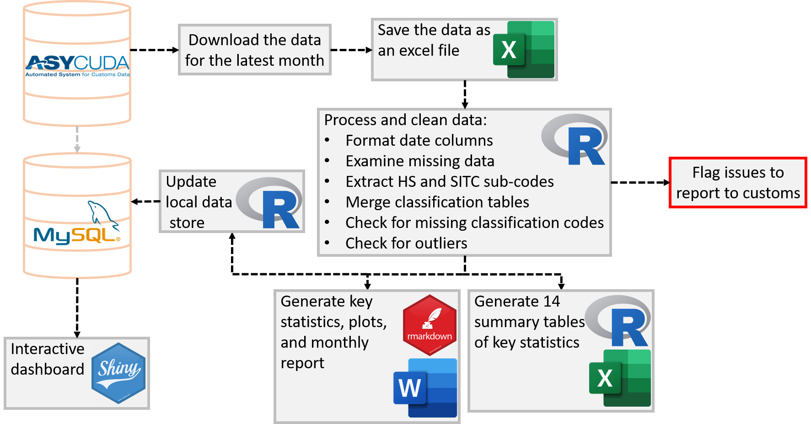

 

             

# Vanuatu National Statistics Office&nbsp;

Producing official statistics for publications is a key function of many teams across Government. It’s a time consuming and meticulous process to ensure that statistics are accurate and timely. With open source software becoming more widely used, there’s now a range of tools and techniques that can be used to reduce production time, whilst maintaining and even improving the quality of the publications. 

> The Reproducible Analytical Pipeline (RAP) is an alternative production methodology for automating the bulk of steps involved in creating a statistical report. 

To know more about the Vanautu National Statistics Office. Click [Here](https://vnso.gov.vu)

## Resources list
- [Introduction to Reproducible Analytical Pipelines](https://ukgovdatascience.github.io/rap_companion/)
    * Free RAP Course [here](https://www.udemy.com/course/reproducible-analytical-pipelines/) 
    * Blog on RAP [here](https://dataingovernment.blog.gov.uk/2017/03/27/reproducible-analytical-pipeline/)
    * Video of Reproducible analysis using R [here](https://www.youtube.com/watch?v=qvPDE4ppAns) 

